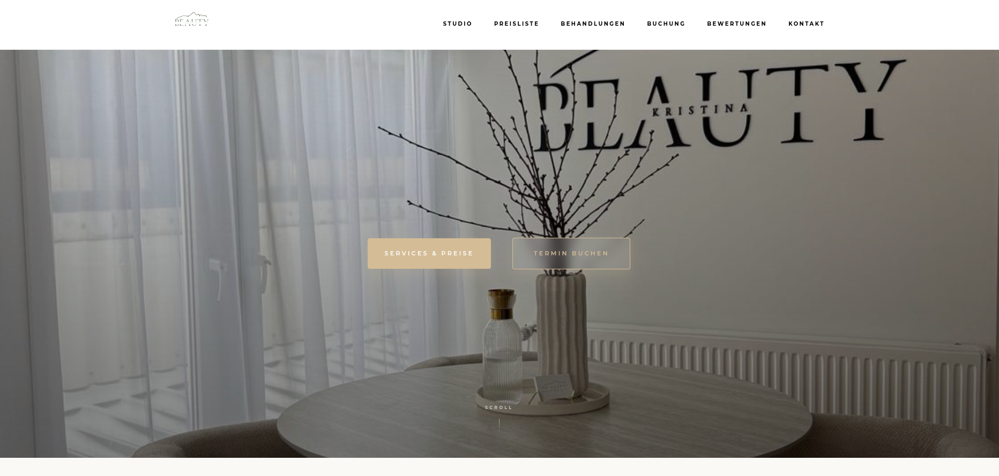

# 💄 Kristina Beauty
**Professionelle Beauty-Services für einen strahlenden Look.**

  
  

---

## 🎨 Über das Projekt
Diese Web-App ist die digitale Visitenkarte für **Kristina Beauty**. Sie dient dazu, Kunden über verschiedene Beauty-Behandlungen zu informieren und eine einfache Kontaktmöglichkeit zu bieten.

### ✨ Highlights der Services:
- 👁️ **Lashes & Brows:** Wimpernlifting und Augenbrauen-Styling.
- 🧖‍♀️ **Facial:** Professionelle Gesichtsbehandlungen.
- 🧴 **Skincare:** Individuelle Beratung für Hautpflege.

---

## 🛠️ Tech Stack
Die Webseite wurde mit Fokus auf Performance und Ästhetik entwickelt:

  

- **Frontend:** React.js mit Tailwind CSS für ein modernes Styling.
- **Deployment:** Automatisiert über Netlify.
- **Design:** Ein elegantes, minimalistisches User Interface.

---
## 🚀 Vorschau

  

---
